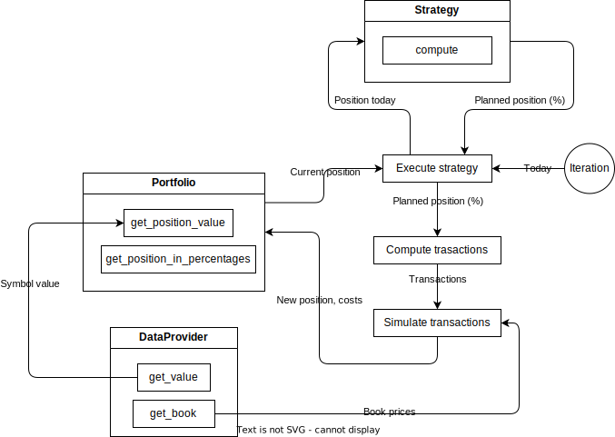

# Organização e arquitetura

A biblioteca utiliza [Protocols](https://realpython.com/python-protocol/) definindo interfaces "fracas" que devem ser implementadas pelo usuário. As interfaces são declaradas no arquivo [interfaces.py](../quantanalyzer/interfaces.py) e contêm basicamente as seguintes classes:

- `DataProvider`: interface para acesso aos preços dos ativos
- `Portfolio`: interface que armazena o portfólio, seu histórico e custos
- `Strategy`: a estratégia de fato do aluno

No início do arquivo são definidos tipos de variáveis meramente para melhor clareza semântica, que o usuário pode eventualmente ignorar caso prefira.

## Conceitos adotados

A seguir apresentamos as definições e algumas tomadas de decisões adotadas.

### Oferta, preço, valor

No mundo real, cada ativo possui um book de ofertas `bid` e `ask` (preço de oferta e compra) que definem o valor de um ativo em certo momento.

Definimos valor como seu entendimento pessoal do preço de um ativo. Fazemos essa distinção especialmente pelo fato de haver momentos de falta de liquidez onde o gap entre `bid` e `ask` são muito grandes ou mesmo falta de oferta. Nesses casos, o valor do ativo não é zero apenas por não existirem ofertas e o usuário terá que definir tal valor, em especial na interface `DataProvider`.

Desta maneira podemos usar os termos preço e valor como sinônimos, porém com a sutil diferença semântica de que valor pode implicar em uma tomada de decisão enquanto preço é de fato um valor real observado.

### Cotas, valor

Cotas representam a quantidade de um item. Valor é quanto vale uma cota.

Também abusamos do conceito de valor quando nos referirmos ao valor de um ativo como sendo o valor de todas as cotas de um ativo ao invés de um valor de cota unitária. Utilize o contexto para diferenciar.

### Portfólio

O portfólio é representado por cotas uma vez que os valores de seus ativos são dinâmicos, i.e., dependem de cada momento.

#### Símbolo CASH

No portfólio, há um símbolo especial `CASH` para representar a moeda de referência da carteira, i.e., é um símbolo que sempre terá valor 1 independente do tempo. Todos os valores da biblioteca devem utilizar essa moeda de referência.

Na prática, se tiver montando uma carteira em dólar, i.e., considerar `CASH` como dólar, é esperado que os valores recebidos pela classe `DataProvider` sejam todos em dólar.

#### Portfólio inicial

Se não fornecida uma carteira inicial, nosso backtesting instancia um portfólio apenas com o símbolo `CASH` e um montante de dinheiro inicial.

### Carteira resultante da estratégia

Para simplificar a codificação da estratégia, a carteira retornada pelo método `compute` de `Strategy` deve estar em percentuais de cada ativo. Retornar as quantidades de cotas implicam em complicações adicionais não triviais e que podem ser resolvidas posteriormente.

O próprio framework irá o converter as quantidades percentuais em cotas, além de calcular os custos de transações.

## Arquitetura

A cada iteração, as interfaces são invocadas para:

1. `Execute strategy`: Executar a estratégia fornecida, via o método `compute`;
2. `Compute transactions`: Computar a diferença percentual entre o planejado e o atual, identificando as mudanças necessárias, e converter as alterações para cotas a fim de obter as transações a serem realizadas;
3. `Simulate transactions`: Computar os custos percentuais e fixos relacionados as transações e atualizar a posição da carteira.
